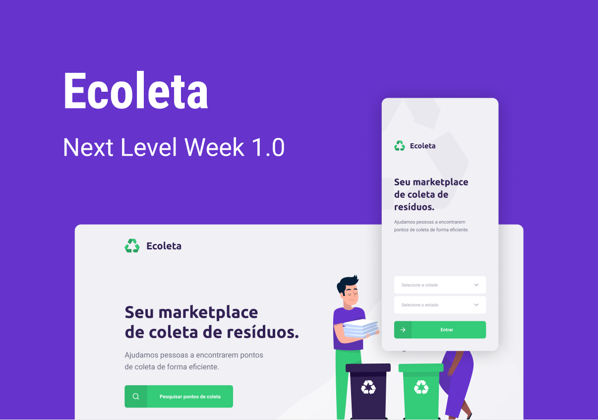
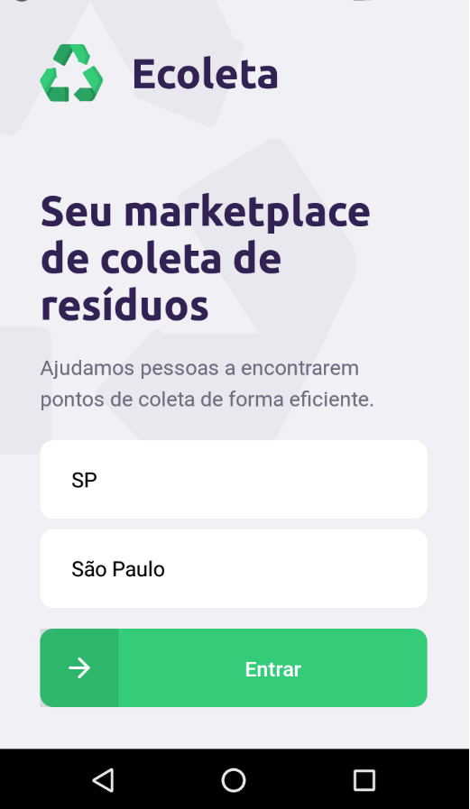
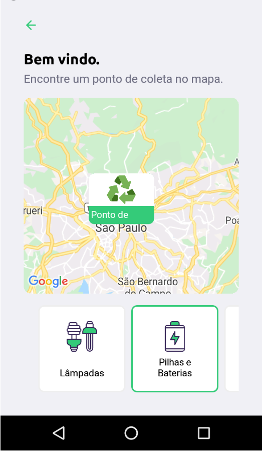
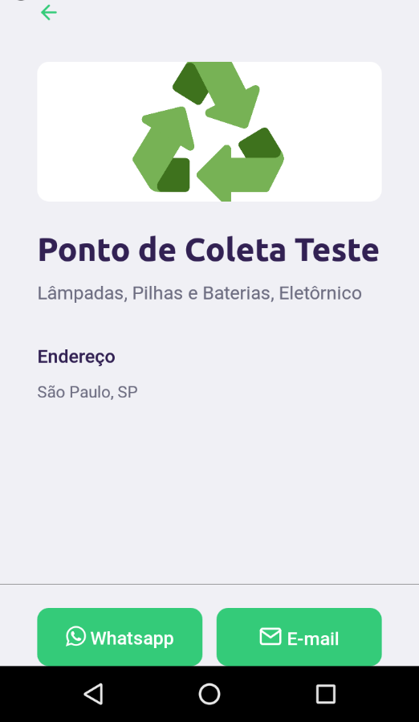

<h3 align="center">
    
</h3>

<h3 align="center">  
  <a href="#information_source-sobre">Sobre</a> |
  <a href="#rocket-tecnologias-utilizadas">Tecnologias</a> |  
  <a href="#licença">Licença</a> 
</h3>

 

## :information_source: &emsp; Sobre

Projeto de uma aplicação Web e Mobile para ajudar pessoas a localizarem pontos de coleta de resíduos para reciclagem.
O Ecoleta foi desenvolvido durante a Next Level Week 1 promovida pela Rocketseat.

## :rocket: &emsp; Tecnologias

- JavaScript
- Node.js
- ReactJS
- React Native
- TypeScript
- HTML
- CSS

## &emsp; Licença
Esse projeto está sob a licença MIT. Veja o arquivo [LICENSE](LICENSE) para mais detalhes.
